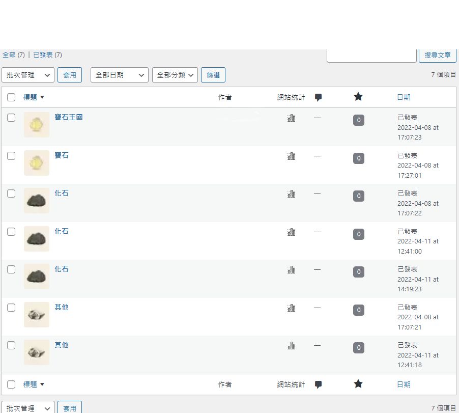
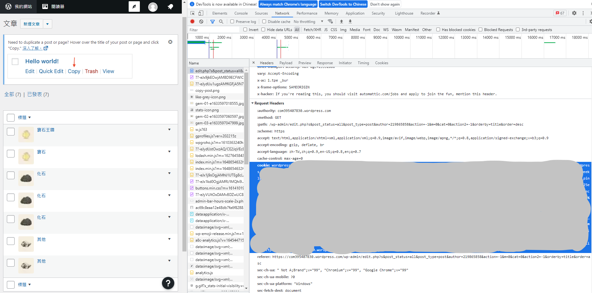

# wordpress-articles-list-generator
 Auxiliary tool

## How to use
1. Enter our wordpress.com admin url and cookie in config.env
2. Run docker-compose up

## Detail
Admin url is the page where we edit or do something to our articles.



In order to let program has right to fetch our admin page content, we need to offer our cookie content.

The following is one way that we can get the cookie.
1. Open DevTools
2. Click Network
3. Refresh admin page
4. Click ```edit.php?....``` in Name block
5. Scroll to **Request Header**
6. Copy cookie value


